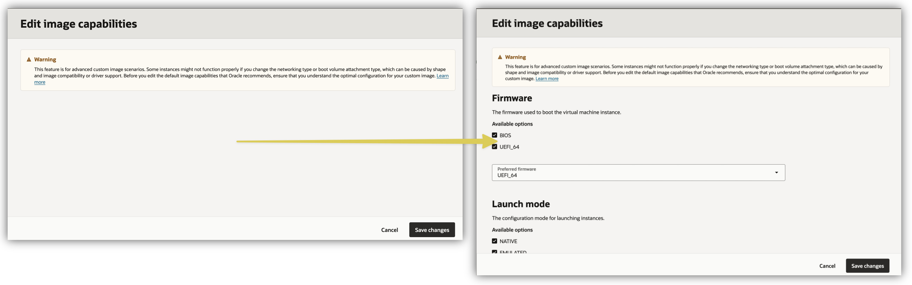
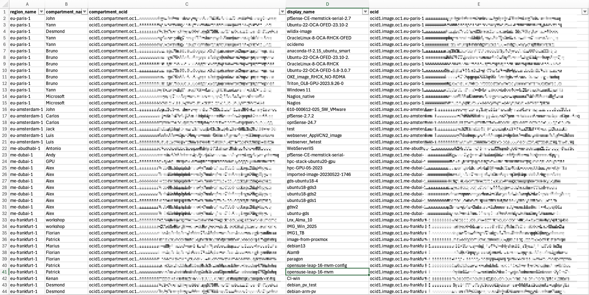
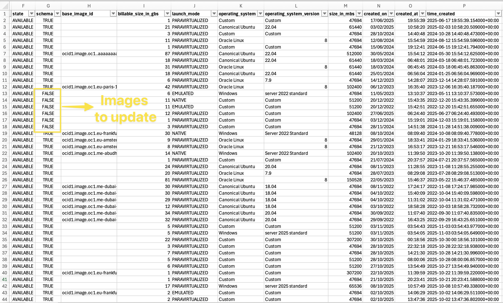
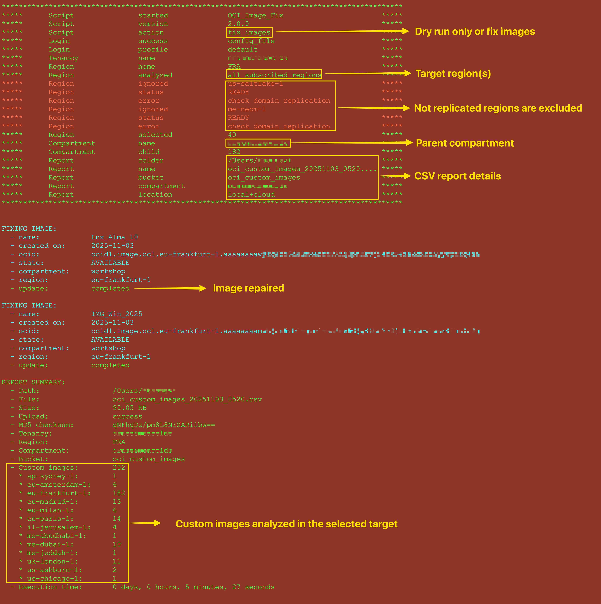

# OCI_Image_Fix

This script quickly identifies custom images that lack an Image Capabilities Schema and automatically updates them by generating a corresponding Image Capabilities Schema.
**Image capabilities** are the configuration options available when launching an instance from an image. 
Some image capability examples are the firmware used to boot the instance, the volume attachment types supported, and so on.



## Quick Start

```
python3 -m pip install oci -U --user
git clone https://github.com/Olygo/OCI_Image_Fix
python3 ./OCI_Image_Fix/OCI_Image_Fix.py
```

 
## How to use ?

	python3 ./OCI_Image_Fix.py

When no arguments are provided, OCI_Image_Fix **automatically**:

- Attempts to authenticate using all available authentication methods:

    1- CloudShell authentication
    
    2- Instance_Principal authentication

    3- Config_File authentication
    
    4- If all authentication fail, prompts the user to provide a config_file custom path and a config_profile section.


## Script options:

OCI_Image_Fix can be fully automated using the following arguments:


| Argument        | Parameter            | Description                                                                                           |
| -------------   | -------------------- | ----------------------------------------------------------------------------------------------------- |
| -auth           | auth_method          | Force an authentication method : 'cs' (cloudshell), 'cf' (config file), 'ip' (instance principals)    | 
| -config_file    | config_file_path     | Path to your OCI config file, default: '~/.oci/config'                                                |
| -profile        | config_profile       | Config file section to use, default: 'DEFAULT'                                                        | 
| -compid         | compartment_ocid     | Target a compartment when you do not have Admin rights at the tenancy level                           | 
| -region         | region_name          | Region name to analyze, e.g. "eu-frankfurt-1" or "all_regions", default: 'home_region'                | 
| -image          | image_ocid           | Fix a single custom image only, this option requires '-region'						                 | 
| -dryrun         | 		             | Report only without modifying any custom image										                 | 
| -bucket         | bucket-name		     | Bucket name to store the report, default: OCI_Custom_Images											 | 
| -rf             | report_folder		 | Local folder path to store the report, default: ./'													 | 
| -rn             | report_name  		 | Name of the CSV report, default: oci_custom_images_YYYYMMDD_HHMM										 | 
| -noupload       | 					 | Do not upload the report to OCI Storage																 | 

## Report

The generated CSV report lists all custom images within the tenancy or the target compartment, including when running in dry-run mode. It contains a "schema" column with values True or False, indicating whether each image requires correction.





## Examples of Usage
##### Default :
	
	python3 ./OCI_Image_Fix.py

try all authentication methods, search for all custom images across the whole tenancy

##### Authenticate using a config_file stored in a custom location:
	
	python3 ./OCI_Image_Fix.py -auth cf -config_file /path/to/config_file 

##### Select a single region:
	
	python3 ./OCI_Image_Fix.py -region eu-paris-1

##### Authenticate with instance principals, target a compartment and a region
	
	python3 ./OCI_Image_Fix.py -auth ip -region eu-paris-1 -compid ocid1.compartment.oc1.fra.xxxx

## Screenshots

##### Script output :



## Setup

If you run this script from an OCI compute instance you should use [Instance Principal authentication](https://docs.public.oneportal.content.oci.oraclecloud.com/en-us/iaas/Content/Identity/Tasks/callingservicesfrominstances.htm).

When using Instance Principal authentication, you need to create the following resources:

##### Dynamic Group

- Create a Dynamic Group called OCI_Scripting and add the OCID of your instance to the group, using :

```
ANY {instance.id = 'OCID_of_your_Compute_Instance'}
```	

##### Policy

- Create a policy in the root compartment, giving your dynamic group the permissions to manage resources in tenancy.
- Define the statement **according to your security constraints.**

```
allow dynamic-group 'Your_Identity_Domain_Name'/'OCI_Scripting' to manage all_resources in tenancy
```

## Questions and Feedbacks ?
**_olygo.git@gmail.com_**

## Disclaimer
**Always ensure thorough testing of any script on test resources prior to deployment in a production environment to avoid potential outages or unexpected costs. The OCI_Image_Fix script does not create any resources in your tenancy.**

**This script is an independent tool developed by Florian Bonneville and is not affiliated with or supported by Oracle. 
It is provided as-is and without any warranty or official endorsement from Oracle**
